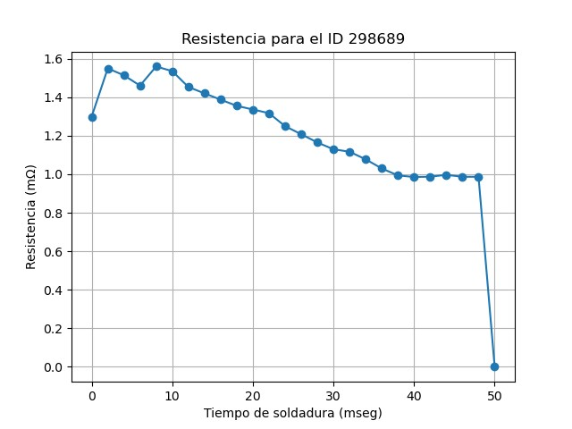
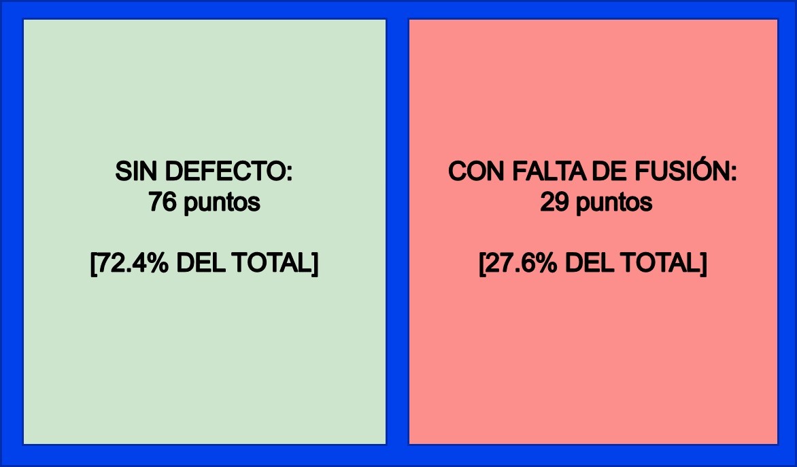
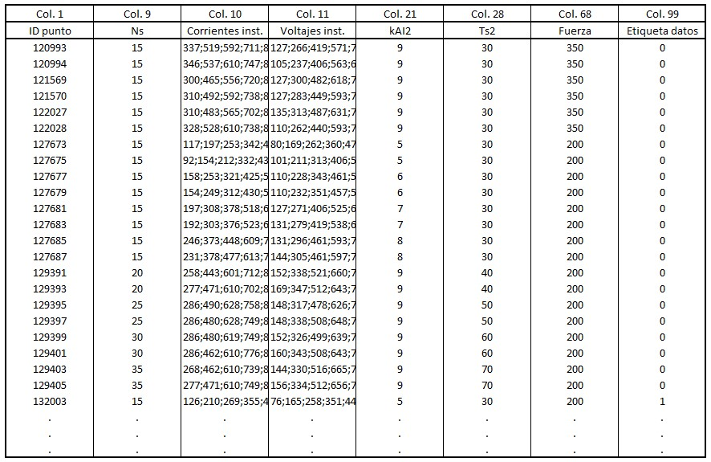
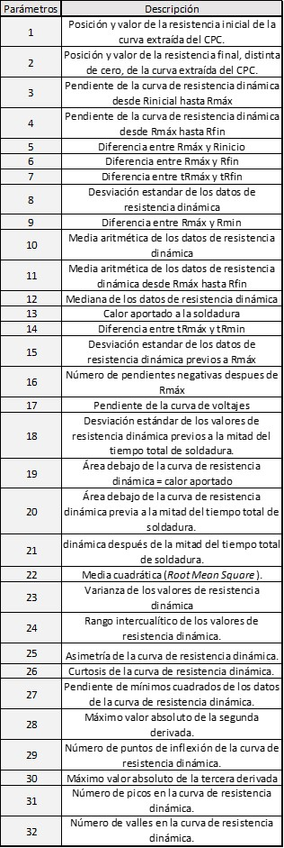
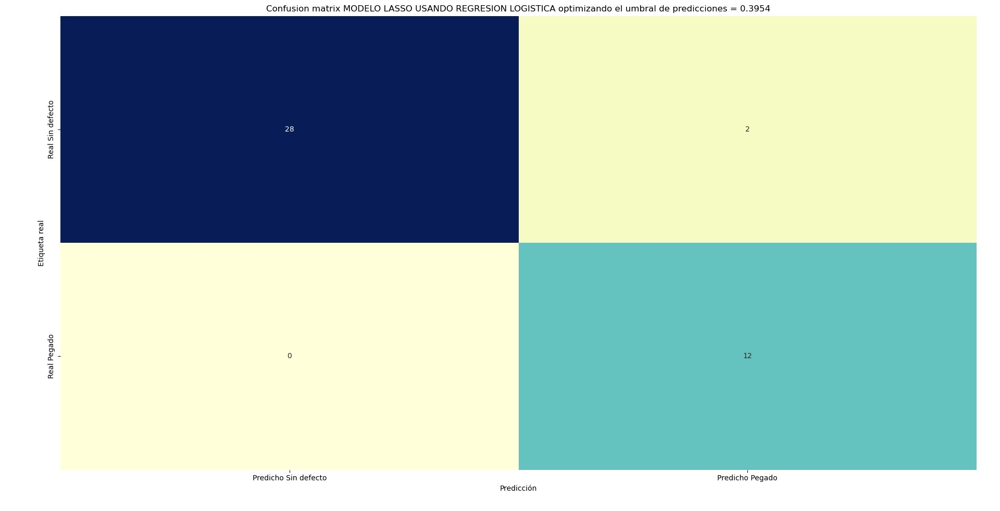
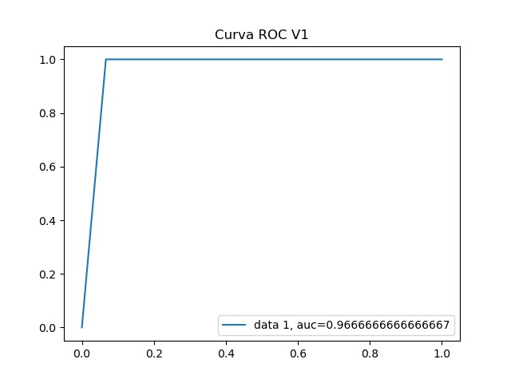

# RESULTADOS MODELO IDENTIFICACIÓN FALTAS DE FUSIÓN

## ÍNDICE
- [RESULTADOS MODELO IDENTIFICACIÓN FALTAS DE FUSIÓN](#resultados-modelo-identificación-faltas-de-fusión)
	- [OBJETIVO](#objetivo)
	- [ADQUISICIÓN DE DATOS](#adquisición-de-datos)
	- [DESCRIPCIÓN DEL MODELO](#descripción-del-modelo)
	- [RESULTADOS OBTENIDOS EN VALIDACIÓN](#resultados-obtenidos-en-validación)
	- [PRUEBAS REALIZADAS EN PIEZAS DE PRODUCCIÓN](#pruebas-realizadas-en-piezas-de-producción)

## OBJETIVO

El objetivo de este código es generar un modelo que, mediante un análisis de parámetros de las curvas de resistencia de puntos de soldadura, sea capaz de determinar las probabilidades de que dicho punto presente defectos o no. En concreto, este modelo se centra en la detección de defectos de faltas de fusión en chapas soldadas mediante soldadura de resistencia por puntos en titanio (CP Ti Gr3). Para ello, se van a analizar 32 parámetros geométricos y estadísticos de las curvas que nos permitan analizar los patrones y variaciones significativas de las mismas.

## ADQUISICIÓN DE DATOS

Los datos de entrada al modelo corresponden con los parámetros de soldadura de los puntos. Para ello, se han soldado probetas con espesores distintos (no se han incluido todos los que se sueldan, pero sí se han incluido los de menor y mayor espesor total) y se han ensayado para determinar si esos puntos son o no aceptables. De esta manera, se ha generado la base de datos contenida en la carpeta `data` (archivo `Inputs_modelo_pegado.csv`).

Los parámetros relevantes del proceso para realizar los cálculos de los inputs son:  

Sin embargo, estos datos no son los que se alimentan al modelo. Como se ha explicado, los datos de entrenamiento y validación del modelo se componen de 32 parámetros estadísticos y geométricos de las curvas de resistencia dinámica. Para ello, el primer paso consiste en realizar un formateo y transformación de los datos. De este modo, se extraen las columnas relevantes del archivo que contiene el "raw data" (archivo `.csv`) y se calculan los distintos parámetros. El *train-test split* se hará de manera estratificada, reservando un 40% de los datos para la validación del modelo.

## DESCRIPCIÓN DEL MODELO

Se ha desarrollado un modelo de regresión logística para analizar los patrones de las curvas. Se ha escogido este tipo de modelo debido a que:

- La clasificación de los datos es binaria. Un 0 corresponde a un punto sin defecto, mientras que una etiqueta igual a 1 corresponde a un punto con defecto de falta de fusión.
- Los coeficientes del modelo nos permiten interpretar fácilmente los resultados. A mayor valor del coeficiente, mayor peso tiene ese parámetro en la decisión final. Esto nos permite analizar si tiene o no sentido que cierto parámetro tenga mayor importancia que otro (sentido físico).
- Funciona bien con relaciones lineales. La relación entre los parámetros de las curvas es lineal, así que este tipo de modelo se ajusta bien a ese tipo de interacciones.
- Funciona bien con un número de datos reducidos. La base de datos no es suficientemente grande como para obtener mejores resultados con otros tipos de modelos.

Debido a la alta colinealidad de los parámetros de entrada del modelo, se ha planteado utilizar una regularización L1 (*Lasso*) que nos permita reducir el número de parámetros totales que usa el modelo (el resto de parámetros tienen coeficientes igual a 0), seleccionando los más importantes. Para comparar los rendimientos de los modelos generados en el proceso de selección de la penalización de la regularización, se ha utilizado el *F2-score*. Esto se debe a que, en nuestro caso concreto, nos interesa reducir al máximo los puntos con defectos clasificados como aceptables, sin importar que el número de retrabajos de puntos realmente buenos (pero clasificados como defectuosos) aumente considerablemente.

Tras este proceso de reducción de dimensionalidad, se ha realizado el análisis de las curvas con únicamente 11 parámetros. Adicionalmente, se ha optimizado el umbral de predicciones del modelo para aumentar el grado de confianza al clasificar puntos como defectuosos. Si la probabilidad de punto defectuoso > 0.3954, se clasificará el punto como malo.

## RESULTADOS OBTENIDOS EN VALIDACIÓN

Se ha calculado la matriz de confusión y la curva ROC en el *set* de validación (datos nuevos no vistos en entrenamiento).

## PRUEBAS REALIZADAS EN PIEZAS DE PRODUCCIÓN

Finalmente, se han extraído datos de producción y se ha corrido el código de manera local con el fin de analizar el rendimiento en pieza real del modelo. Se han probado en dos fases de soldadura de dos piezas distintas (una fase de 292 puntos y otra de 314 puntos). El modelo ha dado los mismos resultados que las inspecciones visuales realizadas en las piezas, es decir, todos los puntos de las piezas se han clasificado como buenos y, de igual manera, en la inspección visual se ha determinado que los puntos de soldadura estaban bien. Las probabilidades obtenidas han sido del orden de 0.001, lo que indica que el modelo está muy seguro de que esos puntos son buenos. De la misma manera, se han analizado los puntos de las probetas previas a la soldadura de las piezas. Las probabilidades de pegados en estas probetas han sido aún menores que en las piezas, lo cual tiene sentido ya que la soldadura en probetas representa un entorno más controlado en el que se puede garantizar una mejor calidad de la soldadura.